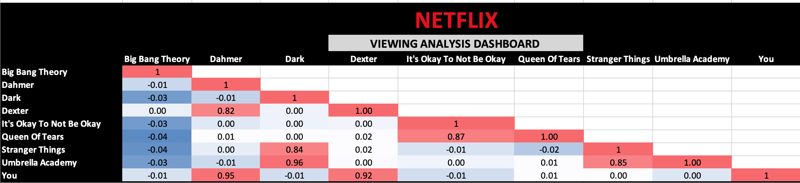

# Netflix Viewing Behaviour Analysis

**Overview:** Analysed 18,000 Netflix viewing records using Excel to understand subscriber viewing behaviour and relationships between different shows.

**Key Analysis:** Data cleaning and transformation, Total Minutes Watched calculation, PivotTable analysis, descriptive statistics, correlation analysis, and correlation matrix.

**Tools:** Microsoft Excel, PivotTables, Data Analysis ToolPak, Data Visualization, Correlation Analysis.

**Key Insights:** Identified viewing patterns across different Netflix shows by analysing 18,000 viewing records and comparing total minutes watched by subscribers.
Correlation analysis revealed relationships between viewing behaviour across different series, helping identify shows with similar audience consumption patterns.
PivotTable and descriptive statistical analysis highlighted differences in content engagement and provided insights into subscriber viewing preferences.

## Correlation Analysis

The correlation matrix was used to identify relationships between viewing patterns across different Netflix shows.

## Scatter Plot Analysis

The scatter plot visualises the relationship between viewing behaviour across selected Netflix shows, helping identify patterns and correlations in subscriber content preferences.

## Project Workflow

1. **Data Cleaning** – Checked and prepared the Netflix viewing dataset for analysis.
2. **Data Transformation** – Created calculated fields including Total Minutes Watched.
3. **PivotTable Analysis** – Summarised viewing behaviour by subscriber and show.
4. **Descriptive Analysis** – Analysed viewing patterns and content consumption.
5. **Correlation Analysis** – Created a correlation matrix to identify relationships between shows.
6. **Data Visualisation** – Used scatter plots to visually explore relationships in viewing behaviour.

## Project Outcome

This project transformed raw Netflix viewing data into structured analytical insights using Excel. The analysis demonstrated how PivotTables, descriptive statistics, correlation analysis, and visualisation can be used to understand subscriber viewing behaviour and relationships between different shows.

## Skills Demonstrated

Microsoft Excel • Data Cleaning • Data Transformation • PivotTables • Exploratory Data Analysis (EDA) • Descriptive Statistics • Correlation Analysis • Data Visualisation
